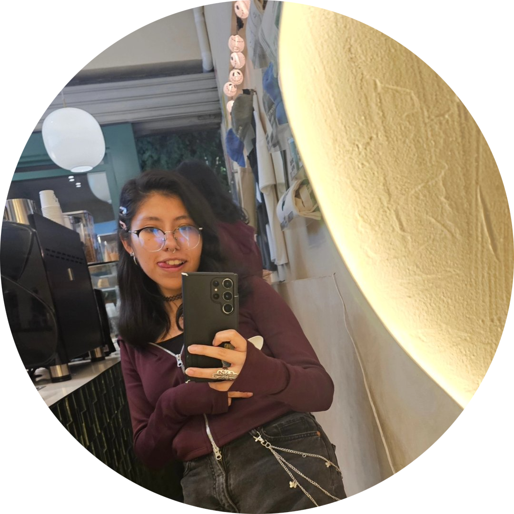

   

  <picture>
    <!-- Móvil -->
    <source media="(max-width: 600px)" srcset="https://readme-typing-svg.demolab.com?font=Fredoka+One&size=28&duration=2300&pause=800&color=FF4D4D&center=true&vCenter=true&width=360&lines=%F0%9F%8E%84+POSADA+PULL+%26+PONCHE+%F0%9F%8E%84;%F0%9F%92%BB+ROMPEME+LA+RAM+%F0%9F%8E%85;%F0%9F%8E%A7+ARRIMON+DE+BUFFER+%F0%9F%8E%81;%F0%9F%8D%B7+PONCHE+POR+REFERENCIA+%E2%9C%A8">
    <!-- PC -->
    
  </picture>

  
  
  

  

<h2 align="center">Ponche por Referencia · Posada 2025</h2>

## 🗓️ Información del Evento

|                    **Cuándo**                    | **Dónde**                                                                                                                                                                                                                                        | **Dress Code**                                |
| :----------------------------------------------: | :----------------------------------------------------------------------------------------------------------------------------------------------------------------------------------------------------------------------------------------------- | :-------------------------------------------- |
| **Sábado 13 de Diciembre 2025  18:00 – 4:00** | 4 minutos de [**Francisco Goitia, Xochimilco, CDMX**](https://www.google.com/maps/place/Francisco+Goitia/@19.2608769,-99.1120638,18.75z/data=!4m6!3m5!1s0x85ce015b200379d1:0xa7987803d729a4bb!8m2!3d19.2607312!4d-99.1112654!16s%2Fg%2F121hfgb_) | **Temática navideña para shot de bienvenida** |

---

## 🧑‍💻 Organizadores

>

<table>
  <tr>
    <td align="center" width="200">
      <a href="https://instagram.com/aldo_emilio.j">
        
         <b>@aldo_emilio.j</b>
      </a>
    </td>
    <td align="center" width="200">
      <a href="https://www.instagram.com/aldo.pvp/">
        
         <b>@aldo.pvp</b>
      </a>
    </td>
  </tr>
  <tr>
    <td align="center" width="200">
      <a href="https://www.instagram.com/arlet.pb/">
        
         <b>@arlet.pb</b>
      </a>
    </td>
    <td align="center" width="200">
      <a href="https://www.instagram.com/rbkespinosa/">
        
         <b>@rbkespinosa</b>
      </a>
    </td>
    </tr>
    <tr>
    <td align="center" width="200">
      <a href="https://www.instagram.com/menezgael/">
        
         <b>@menezgael</b>
      </a>
    </td>
    <td align="center" width="200">
      <a href="https://www.instagram.com/andypandita04/">
        
         <b>@andypandita04</b>
      </a>
    </td>
    </tr>
</table>

---

## 💬 Grupo oficial del evento

> Canal exclusivo para actualizaciones, coordinación y avisos importantes previos al evento.
>   

  

## QR del repo para compartir 👾

  

---

## 🎯 Incluye

- **Comida:** Taquiza de **pastor** alrededor de **7 u 8 pm**.
- **Entretenimiento:** DJ sorpresa, piñatas, karaoke, concursos.
- **Seguridad:** Revisión al ingreso. Personal dentro y fuera del recinto.
- **Comodidad:** Baños limpios por género, luz negra, buen sonido, carpa para las lluvias y buen ambiente.
- **Bebidas:** Mojito de cortesía (sujeto a disponibilidad), agua purificada.

---

## ⚖️ Reglas

> **Importante:** La participación en el evento implica la aceptación de las siguientes normas.

- cero agravios
- cateo al entrar para mayor seguridad
- no mala copas
- traer pisto al gusto
- aburridos en su casa
- cada quién es responsable de sus pertenencias

---

## 🧩 Requisitos para asistir

>

  

---

  © 2025 Ponche por Referencia · Coordinación General

